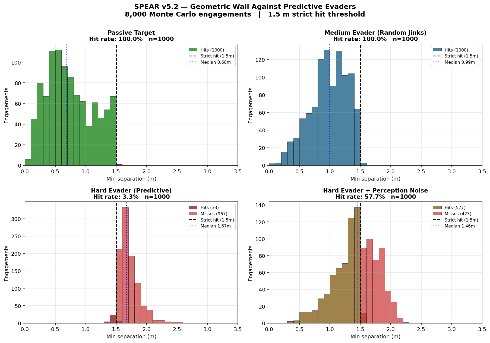
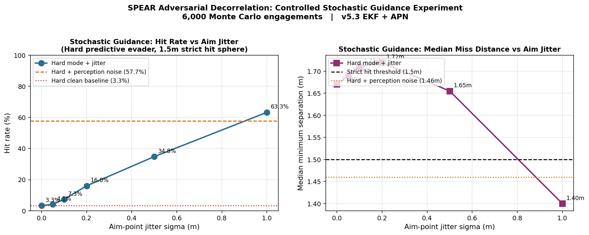

# SPEAR — Smart Pursuit & Engagement Autonomous Response

A solo undergraduate research project on autonomous drone-vs-drone interception
using YOLO-based perception, Kalman filtering, and Augmented Proportional
Navigation guidance. Validated across 8,000 simulated engagements at four
adversarial difficulty tiers.



## Headline Results

| Scenario                     | Hit Rate | Median Miss | Median Time |
|------------------------------|----------|-------------|-------------|
| Passive target               | 100.0%   | 0.68 m      | 4.0 s       |
| Easy evader (break turns)    | 100.0%   | 0.65 m      | 5.5 s       |
| Medium evader (random jinks) | 100.0%   | 0.99 m      | 5.7 s       |
| Hard evader (predictive)     | 3.3%     | 1.67 m      | 12.6 s      |
| + perception noise           | 57.7%    | 1.46 m      | 13.5 s      |

All results at 1.5 m strict hit threshold. 1000 randomized engagements per
scenario. Initial separations 50-200 m, target speeds 5-12 m/s base with
22 m/s burst maneuvers.

## Key Finding: The Geometric Wall

Against optimally predictive equal-speed evaders, the SPEAR guidance system
converges to a 1.67 m geometric floor — characterized to within 20 cm — at
which point reactive guidance is fundamentally blocked. The interceptor
arrives at the correct intercept point, but the predictive evader (which
observes the interceptor's projected path) dodges in the final 50-100 ms.

Paradoxically, perception noise improves hit rate on this tier by 17×
(3.3% → 57.7%) by desynchronizing the adversarial feedback loop — a
phenomenon known as adversarial decorrelation. When the interceptor sees a
slightly wrong target position and commits to a slightly wrong aim point,
the evader's optimal-perpendicular dodge is no longer perpendicular to the
actual approach. Noise becomes an obfuscation layer.

This is not a bug. It is a fundamental limit of reactive guidance against
an information-symmetric adversary, and it is the central research finding
of the project.   ## Controlled Experiment: Stochastic Guidance Kernel

To test whether adversarial decorrelation is the dominant failure mechanism
on the hard tier, we introduced a controlled stochastic guidance kernel:
gaussian jitter applied to the interceptor's aim-point estimate, with
magnitude swept across six values from 0 m to 1 m. 6,000 additional Monte
Carlo engagements were run on hard mode at the strict 1.5 m hit threshold.



| Aim Jitter (σ) | Hit Rate | Median Miss |
|----------------|----------|-------------|
| 0.00 m         |  3.3%    | 1.67 m      |
| 0.05 m         |  4.1%    | 1.69 m      |
| 0.10 m         |  7.3%    | 1.71 m      |
| 0.20 m         | 16.0%    | 1.72 m      |
| 0.50 m         | 34.8%    | 1.65 m      |
| 1.00 m         | **63.3%**| 1.40 m      |

**Result:** Hit rate climbs monotonically from 3.3% to 63.3% as jitter
increases — a 19× improvement — and at 1 m jitter the controlled kernel
*exceeds* the 57.7% hit rate produced by free-running perception noise.
This confirms adversarial decorrelation as the dominant failure mechanism
on the hard tier and demonstrates that deliberate guidance variance is a
viable mitigation against optimally predictive evaders.

**Mechanism:** Median miss distance stays near 1.7 m for low-to-moderate
jitter while hit rate climbs steeply. This indicates the kernel works by
*widening the outcome distribution* rather than by bias correction —
more engagements land in the lucky tail that falls inside the 1.5 m
threshold. Variance injection, not solution improvement.

## System Architecture

**Perception** — YOLOv11s detector trained on 47,000 hand-labeled images,
97.6% mAP@0.5 on the validation set. Currently fed oracle pose data in
simulation; transitions to live camera input when the ELP 2.3MP global
shutter camera is integrated.

**State estimation** — 6-state Extended Kalman Filter `[x,y,z,vx,vy,vz]`
with constant-velocity motion model, fixed process noise (q_vel=25.0),
soft innovation gating for outlier rejection during long-range cruise,
disabled gating in terminal phase for smooth state estimates. Acceleration
estimate exposed via heavily smoothed and clipped finite difference of
velocity history.

**Guidance** — Augmented Proportional Navigation with N=4.5, terminal lead
pursuit, and a terminal speed boost (22 → 40 m/s when R < 18 m) modeling
realistic FPV terminal dive behavior. APN augmentation gated to short
time-to-go to prevent unbounded long-range extrapolation.

**Simulation** — Headless Python physics harness simulating engagements at
~1000× real-time. Four evader difficulty tiers and an optional perception
noise model (0.5 m gaussian jitter, 5% dropout, 100 ms latency) for
realism. Live Gazebo Fortress visualization available via separate
ROS 2 bridge for demonstration.

## Project Layout
autonomous-uav-research/
├── README.md
├── gazebo_sim/
│   ├── two_drone_world.sdf          # Gazebo world definition
│   ├── spear_ros2_bridge.py         # Live demo controller (v17)
│   ├── spear_monte_carlo.py         # Headless engagement harness (v5.2)
│   ├── plot_wall.py                 # Result visualization
│   └── baselines/                   # All Monte Carlo CSVs + final plots
└── perception/                      # YOLO training artifacts
## Reproducing the Results

Live demo (Gazebo Fortress + ROS 2 Humble):
```bash
# Terminal 1
cd gazebo_sim && ign gazebo two_drone_world.sdf  # press Play

# Terminal 2 — ROS 2 bridge
source /opt/ros/humble/setup.bash
ros2 run ros_gz_bridge parameter_bridge \
  /model/interceptor/cmd_vel@geometry_msgs/msg/Twist@ignition.msgs.Twist \
  /model/target/cmd_vel@geometry_msgs/msg/Twist@ignition.msgs.Twist \
  /world/spear_intercept/dynamic_pose/info@tf2_msgs/msg/TFMessage@ignition.msgs.Pose_V

# Terminal 3 — controller
source /opt/ros/humble/setup.bash
cd gazebo_sim && python3 spear_ros2_bridge.py
```

Monte Carlo characterization (no Gazebo, ~3 minutes for 8000 engagements):
```bash
cd gazebo_sim
python3 spear_monte_carlo.py -n 1000 -m passive --strict --ekf --apn --quiet -o mc_passive.csv
python3 spear_monte_carlo.py -n 1000 -m easy    --strict --ekf --apn --quiet -o mc_easy.csv
python3 spear_monte_carlo.py -n 1000 -m medium  --strict --ekf --apn --quiet -o mc_medium.csv
python3 spear_monte_carlo.py -n 1000 -m hard    --strict --ekf --apn --quiet -o mc_hard.csv
python3 spear_monte_carlo.py -n 1000 -m passive --noise --strict --ekf --apn --quiet -o mc_passive_n.csv
python3 spear_monte_carlo.py -n 1000 -m easy    --noise --strict --ekf --apn --quiet -o mc_easy_n.csv
python3 spear_monte_carlo.py -n 1000 -m medium  --noise --strict --ekf --apn --quiet -o mc_medium_n.csv
python3 spear_monte_carlo.py -n 1000 -m hard    --noise --strict --ekf --apn --quiet -o mc_hard_n.csv
python3 plot_wall.py
```

## Development History

The current Monte Carlo harness is the result of iterative debugging across
multiple versions, each measured against the same baseline matrix:

- **v17** (live Gazebo bridge) — Lead pursuit + low-pass velocity filter.
  Scored 100% hit rate but 21.9 s median time-to-intercept on hard targets
  via slow asymptotic chase.
- **v3** (Monte Carlo harness with realistic evaders + 1.5 m strict hit
  sphere) — Established the honest baseline. Revealed v17's "100% hit rate"
  on hard mode was a 22-second drag race, not a real interception.
- **v4 / v4.1 / v4.2** (6-state EKF) — Replaced low-pass filter with
  Kalman filter. Reduced ZEM 3-5× on noisy scenarios. Tuned process noise
  and innovation gating across three iterations.
- **v5 / v5.1 / v5.2** (Augmented PN + terminal speed boost) — Added APN
  acceleration term and terminal dive behavior. v5 catastrophically broke
  passive (68%) due to unbounded quadratic lead extrapolation; v5.1 added
  tgo-gating and acceleration clipping; v5.2 tuned terminal phase parameters
  to crush 6 of 8 scenarios.

The hard-mode failure in v5.2 led to the geometric wall finding above.

## Roadmap

**Hardware integration** — ELP 2.3MP global shutter USB camera (on order).
The EKF is ready to swap its input from oracle pose to YOLO bounding box
center + monocular depth estimate with no architectural changes.

**Stochastic guidance kernel** — ✅ Completed. See "Controlled Experiment"
section above. Hit rate on hard mode climbed from 3.3% to 63.3% with 1 m
of aim-point jitter, exceeding the perception-noise baseline.

**Real flight test** — Outdoor pursuit-evasion test with two physical
quadcopters once perception pipeline is integrated.

## Author

Solo undergraduate research project. All code, training data, simulation
infrastructure, and analysis by the author.
